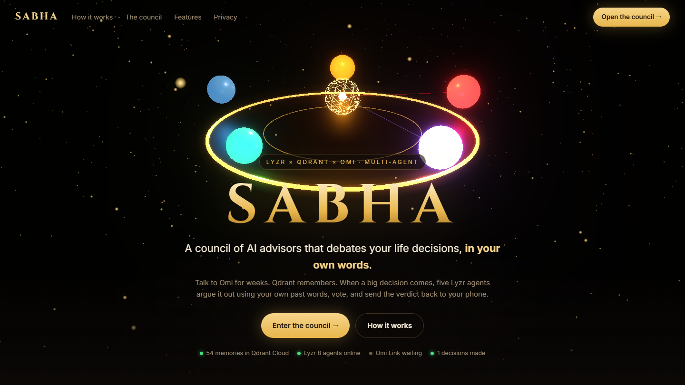
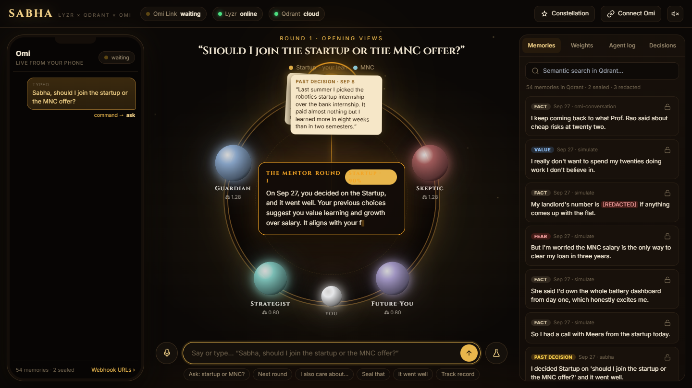
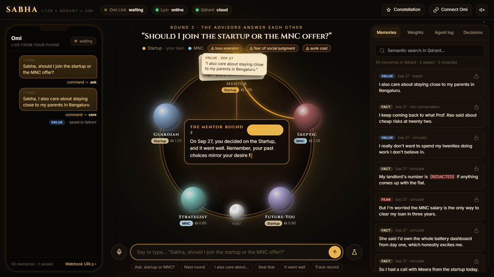
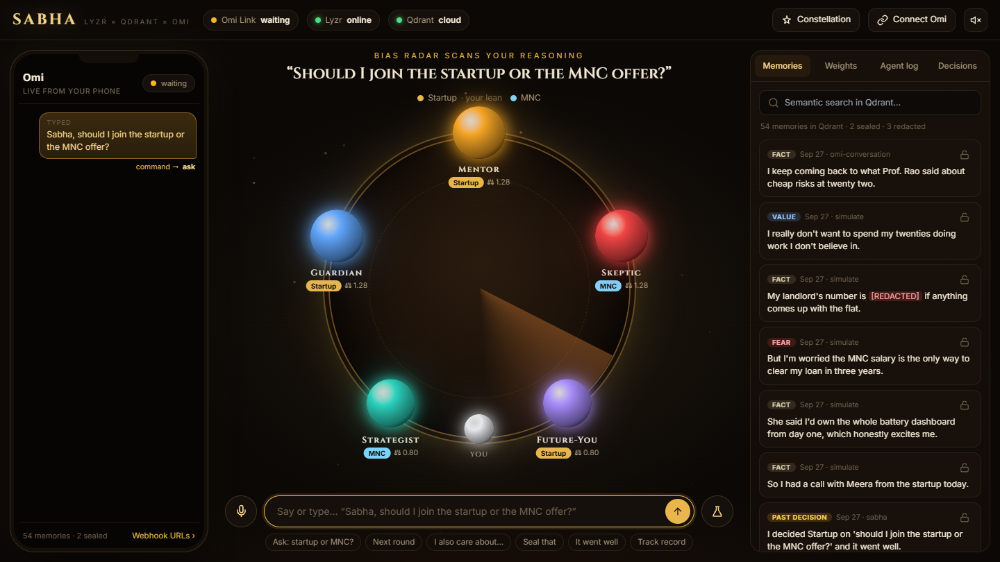
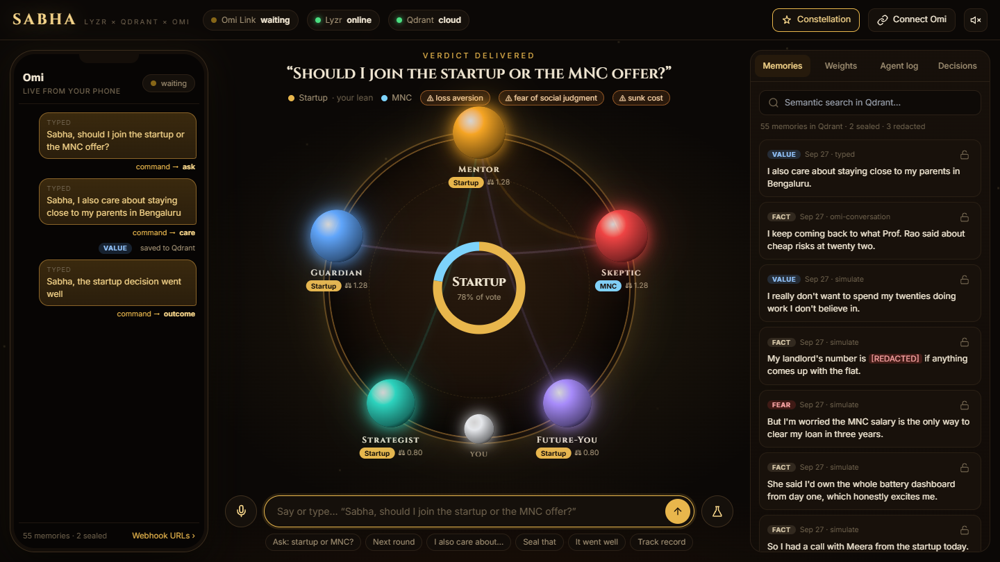
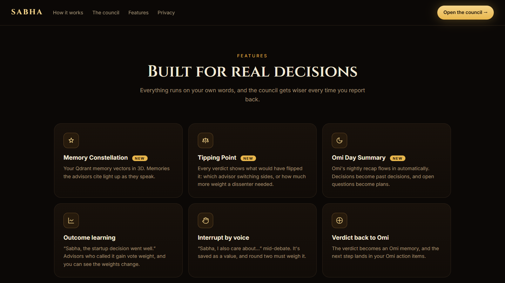
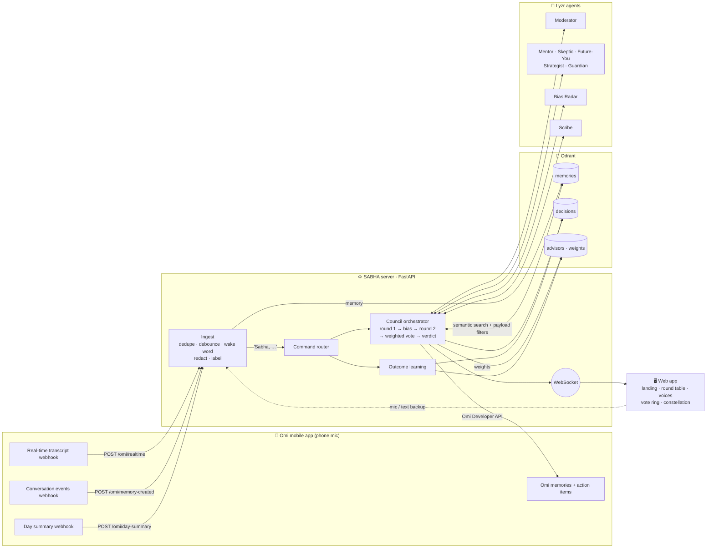
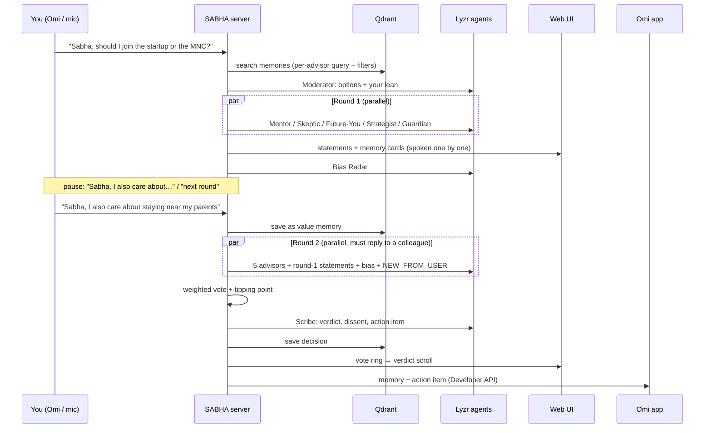

<div align="center">

# SABHA — a council of your own words

**Talk to Omi. Qdrant remembers. Five Lyzr advisors debate your life decisions using your own past words, vote,
and send the verdict back to your phone.**

*Sabha* (सभा) means an assembly or council.


**Hackathon:** Dawn of the Autonomous AI Builder (Lyzr × Qdrant × Omi) · **Track 2: Collaborative Multi-Agent Workflows** · Solo entry



</div>

---

## Table of contents

- [The idea](#the-idea)
- [Screenshots](#screenshots)
- [Features](#features)
- [Architecture](#architecture)
- [How Omi, Qdrant and Lyzr are used](#how-omi-qdrant-and-lyzr-are-used)
- [The council](#the-council)
- [Debate flow](#debate-flow)
- [Voting, tipping point and learning](#voting-tipping-point-and-learning)
- [Memory pipeline](#memory-pipeline)
- [Setup in 5 commands](#setup-in-5-commands)
- [Connecting the Omi app](#connecting-the-omi-app)
- [Running without Omi hardware](#running-without-omi-hardware)
- [Deploy](#deploy)
- [Voice commands](#voice-commands)
- [Configuration](#configuration)
- [API reference](#api-reference)
- [Project structure](#project-structure)
- [Privacy](#privacy)
- [Troubleshooting](#troubleshooting)
- [Tech stack](#tech-stack)

---

## The idea

Big decisions get made with whatever we happen to remember in the moment. Meanwhile, over weeks, we say what
actually matters to us out loud: our goals, our fears, the time we chose the harder path and it paid off, the loan
that keeps us up at night.

SABHA captures those words and puts them to work:

1. **You talk.** You speak into the **Omi** mobile app (no Omi device needed; it uses your phone's mic). Live
   transcripts stream to SABHA over Omi's webhooks.
2. **It remembers.** Every sentence is scrubbed of phone numbers and emails, labelled (`goal`, `value`, `fear`,
   `plan`, `fact`, `past_decision`, or skipped as `noise`), embedded, and stored in **Qdrant**.
3. **The council debates.** You ask, "*Sabha, should I join the startup or the MNC?*" Five **Lyzr** advisor agents
   argue it out **using your own past words**, citing the memory and its date. They get audited by a Bias Radar,
   answer each other, vote with learned weights, and a Scribe writes the verdict.
4. **Verdict back to Omi.** The verdict is saved as an Omi memory and one concrete action item on your phone.
5. **It learns.** Later you say, "*Sabha, the startup decision went well.*" Advisors who called it right gain voting
   power for next time.

---

## Screenshots

| Round 1: an advisor speaks, citing a dated memory | Round 2: advisors answer each other after you interrupt |
|---|---|
|  |  |

| Bias Radar scanning your reasoning | The verdict scroll, with the tipping point |
|---|---|
|  |  |

| Memory Constellation (Qdrant vectors in 3D) | Outcome learning: weights change |
|---|---|
|  |  |



---

## Features

### Core
- **Omi integration.** Real-time transcript and conversation-events webhooks come in; the Omi Developer API sends the
  verdict back out. The UI has an **Omi Link** status (waiting → live → idle) and a phone-shaped panel with your live words.
- **Wake word.** Anything starting with "*Sabha*" (also heard as *Saba*, *Sabah*…) is a command. Everything else
  becomes a memory.
- **Five advisors + Moderator, Bias Radar and Scribe.** That's 8 Lyzr agents, each replying in strict JSON.
- **Grounded arguments.** Every claim cites your memory and its date ("*On Sep 12 you said…*"), or is marked as a
  *guess*. At most 60 words each.
- **Interrupt mid-debate.** "*Sabha, I also care about X*" is saved as a value and injected into round 2, which the
  advisors must weigh.
- **Weighted vote.** Each vote counts as *weight × confidence*, animated into a vote ring. The verdict appears as an
  unrolling scroll.
- **Outcome learning.** Reporting how a decision turned out re-weights the advisors, with animated bars and orb sizes.
- **Privacy controls.** Sealed memories, off-the-record mode, and redaction at ingestion.
- **Cinematic UI.** A round table with glowing orbs. Each advisor speaks in its own browser voice and pulses while
  talking, the others dim, memory cards float out, and reply lines animate between orbs.

### Extras
- 🌌 **Memory Constellation (Three.js).** Your Qdrant memory vectors, projected from 384-d to 3D with PCA, as an
  orbitable star map. Memories of the same kind cluster together. Memories cited in the current debate glow with a
  white halo, and search lights up Qdrant's semantic matches.
- ⚖️ **Tipping Point.** Every verdict says what would have flipped it ("*If the Skeptic switched to Startup, Startup
  would win*") and labels the result *close call*, *clear lean* or *strong consensus*.
- 🌙 **Omi Day Summary.** A third webhook ingests Omi's nightly recap. Decisions made become past decisions, and
  unresolved questions become plans.
- ✨ **Three.js landing page.** A bloom-lit 3D council, how-it-works and privacy sections, and live stats from the
  running server.

---

## Architecture



---

## How Omi, Qdrant and Lyzr are used

### Omi: the ears and the notebook

| Direction | Endpoint | Payload | What SABHA does |
|---|---|---|---|
| Omi → SABHA | `POST /omi/realtime?session_id&uid` | JSON array of transcript segments | Live speech. Deduplicated by `session_id` + segment start + normalised text, and debounced 1.6 s so "*Sabha,*" and "*should I…*" in separate segments become one command. Replies `200` immediately and processes in the background. |
| Omi → SABHA | `POST /omi/memory-created?uid` | Full conversation (`transcript_segments`, `structured`) | Saves only segments that weren't already heard live. Commands are never re-run. |
| Omi → SABHA | `POST /omi/day-summary?uid` | `summary_json` daily recap | Headline and highlights become facts, decisions become past decisions, and open questions become plans. |
| SABHA → Omi | `POST /v1/dev/user/memories` | `{content, category, tags}` | The verdict becomes a memory in your Omi app. |
| SABHA → Omi | `POST /v1/dev/user/action-items` | `{description, due_at}` | One concrete next step, due in 3 days. |

### Qdrant: long-term memory and learned state

Three collections, all using 384-d `BAAI/bge-small-en-v1.5` embeddings computed **locally** with fastembed.
It works with Qdrant Cloud, Docker, or embedded local mode.

| Collection | Payload | Used for |
|---|---|---|
| `memories` | `text, kind, time, sealed, source, redacted` (indexes on `kind`, `sealed`, `time`) | Each advisor retrieves with a semantic query **plus payload filters**: Future-You searches only `kind ∈ {goal, value, plan}`, and the Guardian searches values, fears and past decisions. Inserts are checked for near-duplicates (cosine ≥ 0.97). Also powers the semantic search box and the 3D constellation. |
| `decisions` | `question, options, votes, verdict, confidence, tipping, outcome, chosen, biases` | "*Sabha, the startup decision went well*" finds the right past decision by vector similarity. |
| `advisors` | `name, weight, times_right, total` | Vote weights that change with outcomes. |

### Lyzr: the council

- **8 agents** are created automatically through the Lyzr Agent API (`POST /v3/agents/`), and their ids are cached
  in `data/lyzr_agents.json`.
- Each call goes to `POST /v3/inference/chat/` with a JSON payload (question, options, tagged memories, round-1
  statements, bias findings, anything you said mid-debate) and must return JSON.
- The rules travel both in the agent's instructions and in every message. Behaviour therefore holds even for agents
  edited in Lyzr Studio.
- **Resilience:** if a Lyzr call fails or returns invalid JSON, that one agent falls back to an offline reasoner over
  the same Qdrant memories, so a live demo never dies mid-sentence. The Agent log tab shows `LYZR` or `OFFLINE` for
  every call, with latency.

---

## The council

| Agent | Role | Retrieval focus |
|---|---|---|
| 🟡 **Mentor** | Long-term growth, and who you'll learn from | learning, mentors, skills |
| 🔴 **Skeptic** | Argues **against your current favourite** | fears, doubts, regret |
| 🟣 **Future-You** | Speaks as you in 5 years, **only using goals you actually said** | `goal`, `value`, `plan` only |
| 🟢 **Strategist** | Money, risk, reversibility | loan, EMI, salary, runway |
| 🔵 **Guardian** | Checks options against your stated values | `value`, `fear`, `past_decision` |
| Moderator | Parses the question into options, guesses your lean, opens the session | broad |
| Bias Radar | Flags sunk cost, social proof, loss aversion, stated-vs-revealed conflicts | money/fear/sunk-cost probes |
| Scribe | Writes the verdict, dissent and one concrete action item | all statements |

**Rules are enforced in code, not only in prompts** (`app/debate.py`):
- `say` is capped at **60 words**.
- A claim with no cited memory gets **"(That's my guess.)"** appended.
- Any sentence that shares a 4-gram with a **sealed** memory is replaced with "*I'm drawing on a private memory*".
- Votes are normalised to a valid option, and round-2 `replies_to` must name another advisor.

---

## Debate flow



Lyzr calls within a round run **in parallel**, while the browser **plays them one at a time**: the server waits on
a `playback_done` WebSocket ack before starting the next phase, so voices never overlap.

---

## Voting, tipping point and learning

**Vote:** `value(advisor) = weight × confidence`. The option with the highest total wins, and
`confidence = winner_total / all_totals`.

**Tipping point:** with `gap = winner_total − runner_up_total`:
- An advisor who voted for the winner flips the verdict by switching if `2 × value > gap`.
- An advisor who voted for the runner-up would flip it with weight `w + gap / confidence`, if that stays ≤ 3.0.

The margin gets a label: < 15% is a *close call*, < 40% a *clear lean*, anything higher a *strong consensus*.

**Learning:** when you report an outcome, an advisor was right if `(voted == chosen) == went_well`.
- Right: `weight × (1 + 0.35 × confidence)`
- Wrong: `weight × (1 − 0.25 × confidence)`

Weights are clamped to `[0.3, 3.0]`, and `times_right / total` is tracked per advisor.

---

## Memory pipeline

```
speech → dedupe (session, start, text) → debounce 1.6 s → split on wake word
      ├─ "Sabha, …" → command router
      └─ memory → sentences → redact phones/emails → label kind (or skip noise)
                → embed (bge-small, local) → near-duplicate check → Qdrant upsert → UI
```

- **Redaction:** 10–15 digit phone numbers and emails become `[REDACTED]` before anything is embedded.
- **Labelling:** fast rules decide `past_decision`, `fear`, `goal`, `value`, `plan`, otherwise `fact`. Anything under
  4 words or made of filler is `noise` and skipped.
- **Seed data:** `data/seed_memories.json` holds 42 entries (40 saved, 2 noise) from a final-year engineering
  student over 3 weeks. It includes 1 sealed memory, 1 phone number, 1 email, 2 past decisions (one of them sunk
  cost), and a built-in conflict: "*money doesn't matter*" vs "*scared about the loan*".

---

## Setup in 5 commands

Requires Python 3.12+ and (optionally) `cloudflared` or `ngrok` for the public tunnel.

```bash
python -m venv .venv
.venv\Scripts\activate            # macOS/Linux: source .venv/bin/activate
pip install -r requirements.txt
copy .env.example .env            # macOS/Linux: cp .env.example .env   → then add your keys
python run.py
```

- Landing page: <http://localhost:8765>
- Council app: <http://localhost:8765/council> (click **Enter the Sabha** to enable voices)

On first start SABHA:
- downloads the embedding model (~70 MB),
- seeds Qdrant if it's empty,
- creates the 8 Lyzr agents,
- opens a cloudflared tunnel and prints the webhook URLs.

`python -m scripts.seed` (or **Demo tools → Reset demo data**) restores the 40 clean seed memories.

---

## Connecting the Omi app

In the Omi app, go to **Settings → Developer Mode → Developer Settings** and paste the URLs printed at startup
(also shown under **Connect Omi** in the UI):

| Omi field | URL |
|---|---|
| **Realtime transcript** | `https://<tunnel>/omi/realtime` |
| **Conversation events** | `https://<tunnel>/omi/memory-created` |
| **Day summary** *(optional)* | `https://<tunnel>/omi/day-summary` |
| Audio bytes | leave empty |

For the verdict write-back, create a **Developer API key** in the Omi app (`omi_dev_…`) and set `OMI_API_KEY`.

> The free cloudflared tunnel URL changes every time the server restarts, so re-paste the URLs after a restart.

---

## Running without Omi hardware

SABHA needs **no Omi device**. The Omi mobile app streams your phone's mic. There are also backups:

1. **Omi app on your phone (recommended).** Set the webhooks above and talk. The Omi Link pill turns green.
2. **Browser mic.** Click the 🎙 button (Chrome or Edge, Web Speech API). It uses the same pipeline.
3. **Type.** Use the input bar exactly as if speaking, e.g. `Sabha, next round`.
4. **Simulate.** `GET /simulate?scenario=<name>` (or the **Demo tools** flask button) replays
   `data/demo_omi_session.json` through the real webhook endpoints, in Omi's exact payload formats.
   Scenarios: `memories, question, interrupt, next, seal, offrecord, outcome, track, daysummary, full`.
5. **No tunnel?** Set `TUNNEL=none`, or `TUNNEL=ngrok`, or `PUBLIC_URL=https://…` if you expose the port yourself.

---

## Deploy

SABHA ships with a `Dockerfile` (port 7860, embedding model baked in, tunnel disabled) and runs on any host with Docker
and WebSockets. **Hugging Face Spaces** (free, 16 GB RAM) is the recommended option. Railway, Render and a plain VM
also work.

Quick version:
1. Use **Qdrant Cloud** (`QDRANT_URL`, `QDRANT_API_KEY`), because container disks are temporary.
2. Set the keys (`LYZR_API_KEY`, `OMI_API_KEY`) as secrets, and copy your `data/lyzr_agents.json` ids into the
   `LYZR_AGENT_*` variables so restarts don't create new agents.
3. Set `PUBLIC_URL` to the deployed https URL, deploy, then paste `<url>/omi/realtime` and `<url>/omi/memory-created`
   into the Omi app. Unlike the local tunnel, these URLs never change.

Step-by-step guides for each host are in **[DEPLOY.md](DEPLOY.md)**.

---

## Voice commands

| Say | Effect |
|---|---|
| *Sabha, should I A or B?* | Convene the council |
| *Sabha, next round* | Skip the pause and start round 2 |
| *Sabha, I also care about X* | Saved as a value, injected into the next round |
| *Sabha, seal that* | The last memory becomes private (reasoned with, never quoted) |
| *Sabha, off the record* / *back on* | Pause / resume memory saving |
| *Sabha, the startup decision went well / badly* | Outcome learning: weights change |
| *Sabha, show my track record* | Per-advisor accuracy and weights |
| *Sabha, stop the debate* | Cancel the running debate |

---

## Configuration

All settings live in `.env` (see `.env.example`). No keys are stored in code.

| Variable | Default | Purpose |
|---|---|---|
| `PORT` | `8765` | Server port |
| `SABHA_USER_NAME` | `you` | Your name, for the advisors |
| `QDRANT_URL` / `QDRANT_API_KEY` | *(empty = embedded)* | Qdrant Cloud or Docker endpoint |
| `EMBED_MODEL` | `BAAI/bge-small-en-v1.5` | fastembed model |
| `SEED_ON_START` | `true` | Seed demo memories if the collection is empty |
| `LYZR_API_KEY` | *(empty = offline advisors)* | Lyzr Studio API key |
| `LYZR_PROVIDER` / `LYZR_MODEL` / `LYZR_CREDENTIAL_ID` | `OpenAI` / `gpt-4o-mini` / `lyzr_openai` | Model used when creating agents |
| `LYZR_AGENT_<NAME>` | — | Use your own Studio agent ids instead of auto-created ones |
| `OMI_API_KEY` | *(empty = no write-back)* | Omi Developer API key |
| `SABHA_WEBHOOK_KEY` | — | Optional shared secret (`?key=`) for the webhooks |
| `TUNNEL` / `PUBLIC_URL` | `cloudflared` / — | Tunnel provider or a fixed public URL |
| `AUTO_ADVANCE_SECONDS` | `15` | Pause before round 2 (0 = wait for "next round") |

---

## API reference

| Method | Path | Description |
|---|---|---|
| GET | `/` | Landing page (Three.js) |
| GET | `/council` | Council app |
| WS | `/ws` | Live event stream (state, phone, advisor_say, vote, verdict, …) |
| POST | `/omi/realtime` | Omi real-time transcript webhook |
| POST | `/omi/memory-created` | Omi conversation events webhook |
| POST | `/omi/day-summary` | Omi day summary webhook |
| POST | `/api/speech` | Text or mic input `{text, source}`, same pipeline as Omi |
| GET | `/api/memories?q=` | List memories, or semantic search when `q` is set |
| POST | `/api/memories/{id}/seal` | Seal or unseal `{sealed}` |
| DELETE | `/api/memories/{id}` | Delete a memory |
| GET | `/api/constellation` | Memories with 3D PCA positions |
| POST | `/api/next` | Start the next round |
| POST | `/api/outcome` | `{decision_id, chosen, good}` or `{text}` |
| POST | `/api/reset` | Reset Qdrant to the seed data |
| GET | `/api/state` | Full UI state snapshot |
| GET/POST | `/simulate?scenario=` | Replay Omi-format webhooks |
| GET | `/health` | Health check |

---

## Project structure

```
app/
  main.py        FastAPI: pages, webhooks, WebSocket, REST, /simulate, /api/constellation
  ingest.py      Omi segment dedupe + debounce, wake word, commands, memories, day summary
  memory.py      Qdrant store (3 collections), fastembed, redaction, labelling
  agents.py      8 agent personas + system prompts
  lyzr.py        Lyzr Agent API client (create + chat), JSON parsing
  debate.py      council orchestration, guards, weighted vote, tipping point, outcome learning
  offline.py     offline fallback reasoning (no Lyzr needed)
  omi_api.py     Omi Developer API write-back
  tunnel.py      cloudflared / ngrok launcher
  hub.py         WebSocket broadcast + playback sync
  config.py      .env settings
static/
  landing.html   Three.js landing page (bloom, GSAP ScrollTrigger)
  council.html   the council app (Tailwind + GSAP + Three.js via CDN, Web Speech API, no build step)
data/
  seed_memories.json       42 entries over 3 weeks (40 saved, 2 noise)
  demo_omi_session.json    Omi-format webhook replays for /simulate
scripts/seed.py            reset + seed Qdrant
docs/screenshots/          README images
DEMO_SCRIPT.md             5-minute demo video script
DEPLOY.md                  deployment guide (HF Spaces, Railway, Render, VM)
Dockerfile                 production container
```

---

## Privacy

- **Redaction at the door.** Phone numbers and emails become `[REDACTED]` *before* embedding or storage. Nothing raw
  reaches Qdrant, Lyzr or the UI.
- **Sealed memories.** "*Sabha, seal that*", or the 🔒 button. Sealed memories are still used for reasoning, but:
  - the agents are instructed never to quote them;
  - a server-side 4-gram check strips any sentence that echoes one;
  - the UI and the constellation show them only as "private memory".
- **Off the record.** Nothing is stored until "*back on*". A mid-debate "*I also care…*" still informs the current
  debate but isn't saved.
- **Noise filter.** Filler and fragments are never stored.
- **Local embeddings.** Vectors are computed on your machine. Only the memory snippets relevant to a question are sent
  to Lyzr.
- **Webhook secret.** Set `SABHA_WEBHOOK_KEY` to require `?key=…` on the webhooks.
- **Keys** live only in `.env`, which is git-ignored.
- **Deletion.** `DELETE /api/memories/{id}` removes one memory. `python -m scripts.seed` wipes everything.

---

## Troubleshooting

| Symptom | Fix |
|---|---|
| Port already in use | Set a different `PORT` in `.env`. Docker and WSL often hold 8000, which is why the default is 8765. |
| Omi Link stays "waiting" | Re-paste the webhook URLs (the tunnel URL changes on restart). Check that the console shows the public URL. |
| Lyzr agents ignore the JSON format | This Lyzr API version stores prompts in `agent_instructions`, not `system_prompt`. SABHA sets both and also sends the rules with every message. |
| Lyzr credits run out | The debate continues on the offline advisors. The Agent log shows `OFFLINE`. |
| Embedded Qdrant keeps old data after a reset | Reset deletes points (not collections) to work around a Windows file-lock quirk. Use Qdrant Cloud or Docker for production. |
| No voices | Click **Enter the Sabha** (browsers need a user gesture), and check that the 🔊 button isn't muted. |

---

## Tech stack

**Backend:** Python, FastAPI, Uvicorn, WebSockets, httpx, qdrant-client, fastembed (ONNX), NumPy (PCA)
**AI & data:** Lyzr Agent API (8 agents, gpt-4o-mini), Qdrant (Cloud / Docker / embedded), BAAI/bge-small-en-v1.5
**Voice & device:** Omi mobile app webhooks + Omi Developer API, Web Speech API (speech synthesis + recognition)
**Frontend:** Three.js (bloom post-processing, OrbitControls), GSAP (+ ScrollTrigger), Tailwind CDN. A single HTML file per page, no build step.
**Infra:** cloudflared quick tunnel (or ngrok)

See **[DEMO_SCRIPT.md](DEMO_SCRIPT.md)** for the 5-minute demo walkthrough.

<div align="center"><sub>Built solo for the Dawn of the Autonomous AI Builder hackathon · Lyzr × Qdrant × Omi</sub></div>
